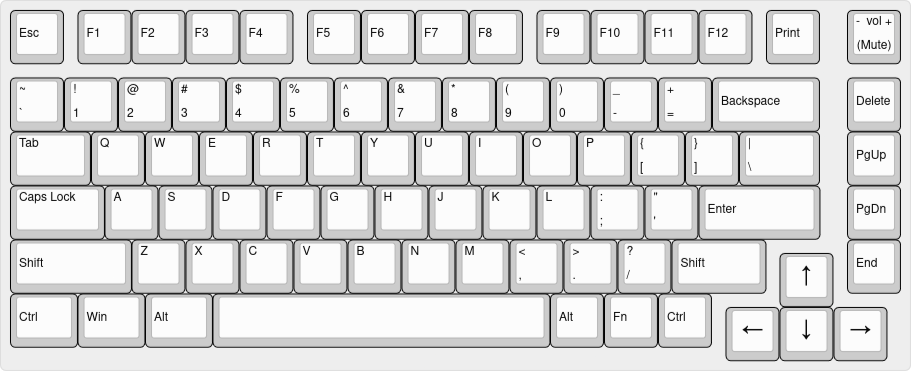
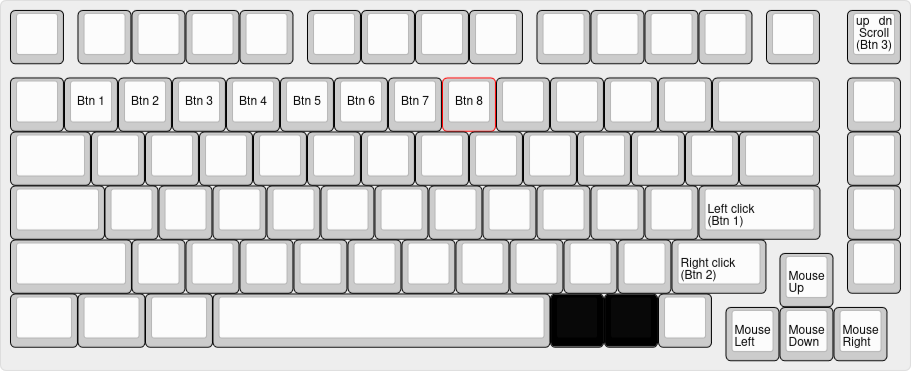

### features

- via enabled
- mouse control
- n key rollover
- rgb matrix sleep

### changes

- fn+space to reset (instead of fn+backslash)
- fn+del = ins
- fn+pgup = pause/break (brightness up on macos)
- fn+pgdn = scroll lock (brightness down on macos)
- fn+end = app menu
- fn+n = toggle n key rollover
- lower left mod key cluster = media controls
	- fn+lctrl = prev
	- fn+lsuper = play/pause
	- fn+lalt = next
	- fn+lshift = stop
- function keys = 2nd row function keys
	- fn+f1 = f13
	- fn+f2 = f14
	- ...
	- fn+f12 = f24
- fn + arrow keys used for nav
	- fn + left = home
	- fn + right = end
	- fn + up = page up
	- fn + down = page down
- rgb control moved to qwer/asdf + z/x + t
	- fn+q/a = hue increase/decrease
	- fn+w/s = saturation increase/decrease
	- fn+e/d = value increase/decrease
	- fn+r/f = speed increase/decrease
	- fn+z = rgb mode forward
	- fn+x = rgb mode reverse
	- fn+t = rgb toggle
	- fn+rotary also controls rgb mode (cw forward, ccw backward, click to toggle)
- mouse control on layer 2 (fn+ralt)
	- fn+ralt+arrow keys to move
	- fn+ralt+enter = left click
	- fn+ralt+rshift = right click
	- fn+ralt+rotary = scroll up ccw, scroll down cw (click for middle click)
	- fn+ralt+1 = mouse button 1
	- ...
	- fn+ralt+8 = mouse button 8

### rgb effects enabled

sidebars are constant rainbow. capslock on = red keys.

1. solid color
1. rainbow gradient up down
1. rainbow gradient left right
1. breathing
1. rainbow cycle all
1. rainbow cycle left right
1. rainbow cycle up down
1. rainbow cycle out in
1. flower blooming
1. solid reactive
1. multisplash
1. solid multisplash
1. starlight
1. starlight dual sat
1. riverflow

### layers

images created using [keyboard layout editor](https://www.keyboard-layout-editor.com)

#### layer 0

#### layer 1

#### layer 2

### misc

i am taking suggestions for possible improvements to this keymap; you may contact me via the following

- email: mailto:a@trwnh.com
- chat: xmpp:a@trwnh.com
- fediverse: https://mastodon.social/@trwnh